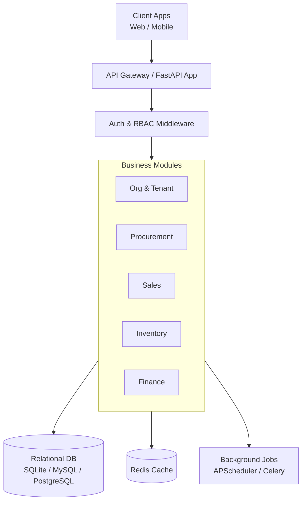
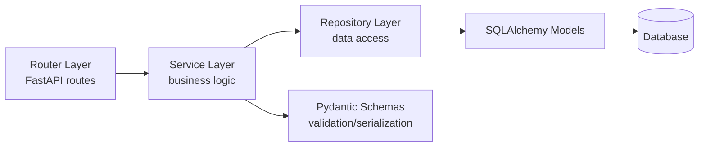
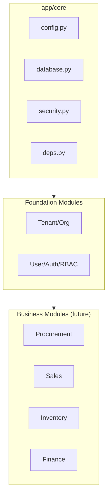
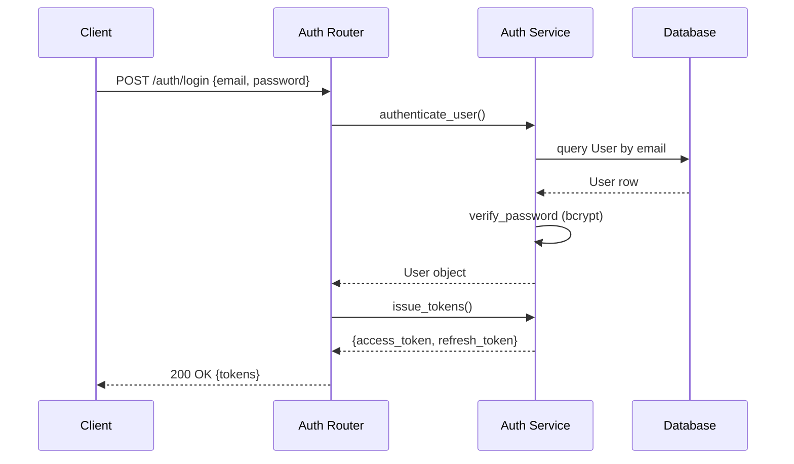
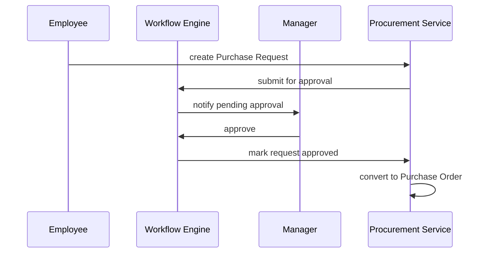
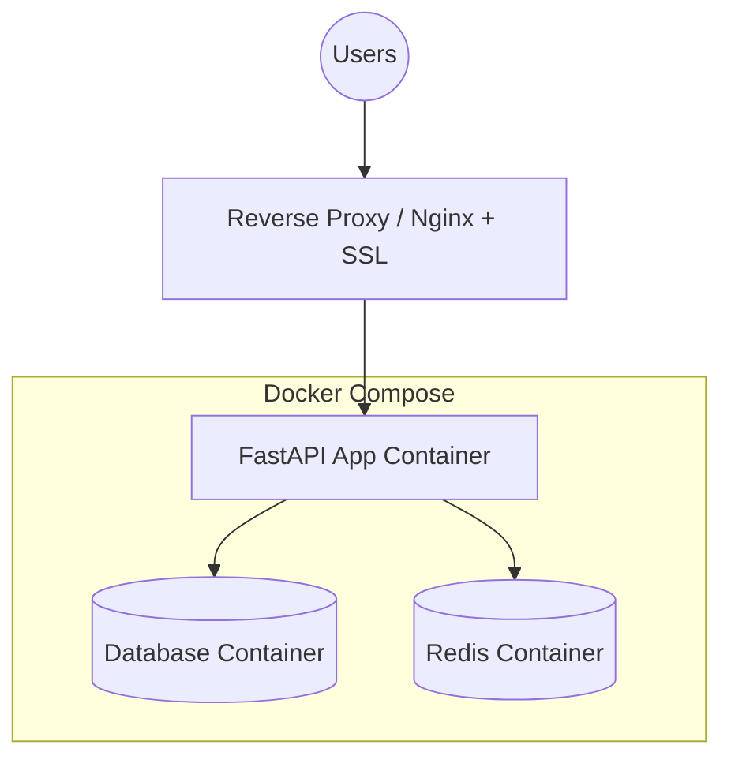

# Phase 3 — System Architecture

## 1. High-Level Design (HLD)

## 2. Low-Level Design (LLD) — Layered pattern per module

Every module (Procurement, Sales, Inventory, Finance, etc.) follows this same four-layer
pattern: **Router → Service → Repository → Model**, so the codebase stays predictable
as it grows to 35 phases.

## 3. Component Diagram

## 4. Sequence Diagram — Login flow

## 5. Sequence Diagram — Purchase Request → PO approval (future module)

## 6. Deployment Architecture

**Target production setup**: Nginx reverse proxy with SSL termination in front of the
FastAPI app, MySQL/PostgreSQL as the primary database, Redis for caching and as the
Celery/APScheduler broker, all orchestrated via Docker Compose for the MVP stage.
