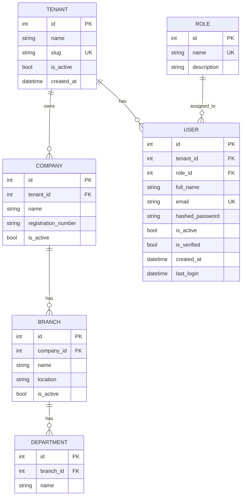

# Phase 4 — Database Architecture

## 1. Scope note

The original spec calls for 200+ normalized tables across all 35 phases. Building all
200+ upfront before any module has real data flowing would be premature — most would
sit empty and unvalidated. Instead, this document defines the **core schema (currently
implemented)** plus the **normalized pattern** every future module's tables must follow,
so the schema can grow to 200+ tables safely as each phase is built.

## 2. Core ER Diagram (currently implemented)

## 3. Normalization pattern (applies to every future table)

- Every table gets a surrogate integer PK (`id`).
- Every tenant-scoped table gets a `tenant_id` FK, indexed, and every query filters on it.
- Foreign keys always reference the surrogate PK of the parent, never a natural key.
- Lookup/reference data (roles, statuses, categories) lives in its own table rather than as free-text columns, to keep 3NF.
- Money fields use `DECIMAL(18,2)`, never float.
- Every table gets `created_at`; mutable-state tables also get `updated_at`.

## 4. Index Strategy

- Primary keys: automatically indexed (clustered).
- Foreign keys: always explicitly indexed (`index=True` in SQLAlchemy) — this is the single highest-impact index for join-heavy ERP queries.
- Unique business keys (`email`, `slug`, invoice numbers, PO numbers): unique index.
- Composite indexes planned for high-traffic filtered queries once built, e.g. `(tenant_id, status)` on orders/invoices tables, since almost every list-view query filters by tenant + status.
- Avoid over-indexing write-heavy tables (e.g. transaction logs) — index only what reporting/search actually queries.

## 5. Partitioning Strategy (planned, for production scale)

- **Candidate tables**: transaction-heavy tables — ledger entries, stock movements, audit logs, notifications.
- **Strategy**: range partitioning by month/year on `created_at`, so old partitions can be archived or dropped without touching hot data.
- **Not implemented at MVP stage** — SQLite/single-instance MySQL doesn't need it yet; this becomes relevant once transaction volume or table size (hundreds of millions of rows) justifies the operational complexity.

## 6. Data Archival Strategy

- Financial and audit records: never hard-deleted; archived to cold storage (e.g. yearly export to compressed CSV/Parquet) after a retention period (commonly 7 years for financial records, subject to local regulation).
- Operational/log data (notifications sent, search analytics): rolling retention (e.g. 90 days) with periodic purge job.
- Soft-delete pattern (`is_active` / `deleted_at`) used for master data (users, products, customers) instead of hard deletes, to preserve referential integrity in historical transactions.
